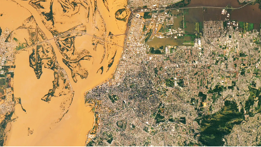
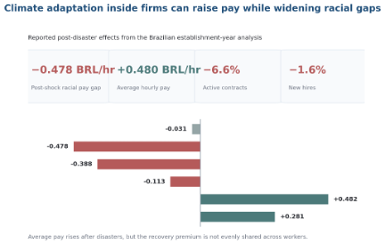

# Climate-Induced Racial Pay Gaps
### How Firms Adapt to Climate Risk Through Compensation Reallocation

---

**Research Stage:** Working Paper

> Climate adaptation inside firms is not only about resilience spending. It is also about who captures post-disaster pay premia. Linking Brazil's universe of formal employer–employee data to geocoded climate disasters, this project shows that average pay can rise after shocks while racial pay gaps widen inside the same establishment.

---

## Why Now

When climate disasters disrupt operations, firms do not only repair assets and restore logistics. They also make rapid internal decisions about wages, retention, hiring, and role assignment. These choices have distributional consequences that have gone largely unmeasured.

---

## Project Description

When climate disasters disrupt operations, firms do not only repair assets and restore logistics. They also make rapid internal decisions about wages, retention, hiring, and role assignment. This project asks whether those compensation responses are evenly shared or whether they widen inequality inside the firm.

The setting is Brazil's formal sector, where matched employer–employee data make it possible to observe wages, hours, race, occupation, and establishment identifiers across virtually the universe of formal employment. These data are linked to geocoded climate-related disasters to build an establishment-year panel and trace what happens inside workplaces after local shocks. The empirical design focuses on within-establishment racial pay gaps, which isolates internal allocation choices from broad regional labor market effects.

The results suggest that climate adaptation operates partly through unequal compensation reallocation. Before disasters, the average within-establishment nonwhite–white pay gap is economically small and statistically indistinguishable from zero. After disaster exposure, the gap widens to –0.478 BRL per hour, roughly a 22 percent increase relative to the pre-disaster gap. At the same time, average hourly compensation rises by about +0.480 BRL and incumbent pay rises by +0.482 BRL, consistent with a recovery premium that is not evenly distributed. Gaps also widen among incumbents and within lower-skill roles, while employment contracts fall by about 6.6 percent and hiring declines modestly.

The broader point is that climate adaptation has an internal distributive dimension. Firms are not just passive recipients of environmental shocks. They are strategic actors whose pay-setting choices can amplify or dampen inequality during recovery. That makes climate resilience a question not only of operational continuity, but of how organizations choose to allocate the gains and burdens of adaptation.

---

## Visuals

*Figure 1: Flooding around Porto Alegre, Brazil, after torrential rains in May 2024. Photo credit: NASA Earth Observatory / Wanmei Liang.*

---

*Figure 2: Reported post-disaster compensation effects from the Brazilian establishment-year analysis. Values draw from the manuscript outline and extended abstract.*
